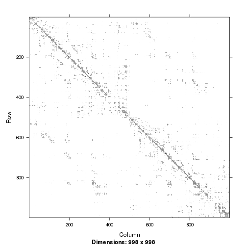
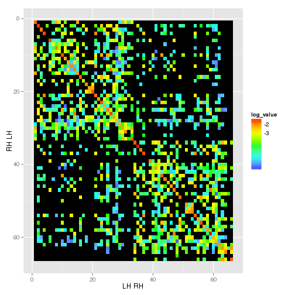
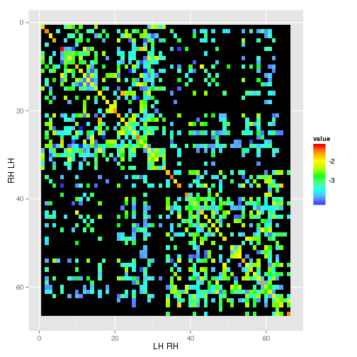
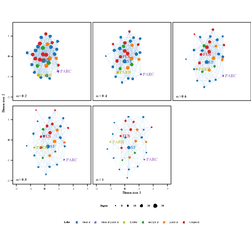
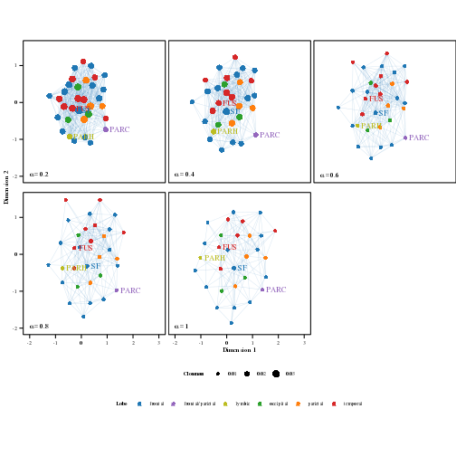
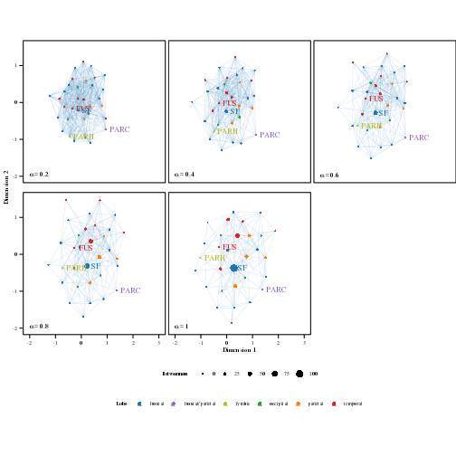

```r
opts_chunk$set(tidy = TRUE, cache = TRUE)
```

# Analysis on regional aggregation of DTI data

This vignette describes how to regionally aggregate DTI data.

<h2> The DTI dataset </h2>

In this example we'll use data from Hagmann et al. (2008), which is publicly available [here](http://www.cmtk.org/datasets/homo_sapiens_01.cff). 

We load the data:

```r

library(plyr)
library(stringr)
source("utils_DTI.R")
load("homo_sapiens_01.Rdata")  #Same thing
nROI <- length(unique(dat.all[[1]]$links$source.index))
```

Structure of the data: dat.all is a list with 6 element, one per subject. Each of these elements is in turn a list containing 3 elements, "nodes", "link" and "info". 

- *nodes* is a list of brain regions (the Lausanne2008 parcellation in Freesurfer). They have names like "paracentral 2". If you remove the index you get the rougher parcellation (66 regions, 33 per hemisphere) used in the paper.

```r
head(unique(laply(str_split(dat.all[[1]]$nodes$dn_free, " "), function(v) v[[1]])))
```

```
## [1] "lateralorbitofrontal"     "superiorfrontal"         
## [3] "caudalmiddlefrontal"      "precentral"              
## [5] "paracentral"              "rostralanteriorcingulate"
```

- *info* describes the fields
- *links* is a data.frame with one link per line, e.g

```r
h(dat.all[[1]]$links)
```

```
##   target source     id de_strength source.index target.index
## 1     n1    n12  e12_1   0.0157509           12            1
## 2     n1    n47  e47_1   0.0086142           47            1
## 3     n1    n44  e44_1   0.0003353           44            1
## 4     n1    n11  e11_1   0.0009091           11            1
## 5     n1   n588 e588_1   0.0001260          588            1
## 6     n1    n37  e37_1   0.0002070           37            1
```

Most fields should be self-explanatory. de_strength is the connection density index described in the paper. 

To extract the names and indeces of the regions and add them to the *links* data.frame use get.region.names.indeces(), e.g.

```r
dat.all <- llply(dat.all, get.region.names.indeces)
names(dat.all[[1]]$links)
```

```
##  [1] "target.index"   "source.index"   "target"         "source"        
##  [5] "id"             "de_strength"    "source.region"  "source.struct" 
##  [9] "source.hemi"    "source.reg.ind" "source.lobe"    "target.region" 
## [13] "target.struct"  "target.hemi"    "target.reg.ind" "target.lobe"   
## [17] "intra.hemi"
```

```r
dat.all[[1]]$links[1, ]
```

```
##   target.index source.index target source    id de_strength
## 1            1           60     n1    n60 e60_1    0.001355
##             source.region          source.struct source.hemi
## 1 RH_rostralmiddlefrontal rostralmiddlefrontal 3          RH
##   source.reg.ind source.lobe           target.region
## 1             60     frontal RH_lateralorbitofrontal
##            target.struct target.hemi target.reg.ind target.lobe intra.hemi
## 1 lateralorbitofrontal 1          RH             45     frontal       TRUE
```


Regional indeces are in alphabetical order, left hemisphere first:

```r
regions <- unique(subset(dat.all[[1]]$links, select = c("source.region", "source.reg.ind", 
    "source.hemi", "source.lobe")))
regions <- regions[with(regions, order(source.reg.ind)), ]
regions[1:10, ]
```

```
##                    source.region source.reg.ind source.hemi source.lobe
## 20029                LH_bankssts              1          LH    temporal
## 1377  LH_caudalanteriorcingulate              2          LH     frontal
## 1715      LH_caudalmiddlefrontal              3          LH     frontal
## 5215                   LH_cuneus              4          LH   occipital
## 10051              LH_entorhinal              5          LH    temporal
## 435               LH_frontalpole              6          LH     frontal
## 10387                LH_fusiform              7          LH    temporal
## 7289         LH_inferiorparietal              8          LH    parietal
## 600          LH_inferiortemporal              9          LH    temporal
## 2391         LH_isthmuscingulate             10          LH     frontal
```

We define a grouping vector of length 994 (the number of ROIs), that assigns a regional index to each ROI:

```r
sub1 <- unique(subset(dat.all[[1]]$links, select = c("source.index", "source.reg.ind")))
sub2 <- unique(subset(dat.all[[4]]$links, select = c("source.index", "source.reg.ind")))
sub <- unique(rbind(sub1, sub2))
sub <- sub[with(sub, order(source.index)), ]
sub[1:10, ]
```

```
##    source.index source.reg.ind
## 40            1             45
## 2             2             45
## 10            3             45
## 58            4             45
## 31            5             45
## 76            6             45
## 52            7             45
## 85            8             45
## 33            9             45
## 5            10             45
```

```r
group <- sub$source.reg.ind
group[1:20]
```

```
##  [1] 45 45 45 45 45 45 45 45 45 45 45 45 45 45 45 45 45 45 45 52
```

For each subject, we can build adjacency matrices based on the connectivity data:

```r
AL <- llply(dat.all, connectivity.matrix)
AL[[1]][1:5, 1:5]
```

```
## 5 x 5 sparse Matrix of class "dgCMatrix"
##                                                   
## [1,] .        0.0809086 0.009018 .       .        
## [2,] 0.080909 .         0.013128 .       0.0006734
## [3,] 0.009018 0.0131276 .        0.02391 .        
## [4,] .        .         0.023914 .       .        
## [5,] .        0.0006734 .        .       .
```

```r
image(AL[[1]])
```

 

The adjacency matrices can readily be stored as graphs using the `igraph` package:

```r
if (suppressWarnings(require(igraph)) == FALSE) {
    install.packages("igraph")
}
library(igraph)
GL <- llply(AL, function(A) graph.adjacency(A, mode = "undirected", weighted = TRUE))
```


Then, the regional subgraph can be computed:

```r
regGL <- llply(GL, graph.group, gvec = group)
```


To plot, we switch back to the adjacency matrix representation and add a log-transformed connectivity strength:

```r
regAL <- llply(regGL, function(G) get.adjacency(G, type = "both", attr = "weight"))
regA.df <- ldply(regAL, function(A) melt(a.m(A)))
regA.df <- mutate(regA.df, log_value = log10(value))
regA.df$log_value[which(regA.df$log_value == -Inf)] <- NA
head(regA.df)
```

```
##   .id Var1 Var2   value log_value
## 1  A1    1    1 0.02283    -1.641
## 2  A1    2    1 0.00000        NA
## 3  A1    3    1 0.00000        NA
## 4  A1    4    1 0.00000        NA
## 5  A1    5    1 0.00000        NA
## 6  A1    6    1 0.00000        NA
```

We plot the regional adjacency matrix for scan A1:

```r
ggplot(subset(regA.df, .id == "A1"), aes(Var2, Var1, fill = log_value)) + xlab("LH RH") + 
    ylab("RH LH") + geom_raster() + scale_y_reverse() + scale_fill_gradientn(colours = rainbow(5, 
    s = 1, v = 1, start = 0, end = 0.66), breaks = seq(-3, 0), values = seq(1, 
    0, l = 7), na.value = "black")
```

 


This, unfortunately, does not resemble the results that are presented in the supporting figure S2 of Hagmann et al (2008).

Try taking log-transforming the connectivity strengths before building the regional subgraph:

```r
logAL <- llply(AL, function(A) {
    A <- log10(A)
    A[A == -Inf] <- NA
    A
})
logGL <- llply(logAL, function(A) graph.adjacency(A, mode = "undirected", weighted = TRUE))
reg.logGL <- llply(logGL, graph.group, gvec = group)
reg.logAL <- llply(reg.logGL, function(G) get.adjacency(G, type = "both", attr = "weight"))
reg.logA.df <- ldply(reg.logAL, function(A) melt(a.m(A)))
head(reg.logA.df)
```

```
##   .id Var1 Var2  value
## 1  A1    1    1 -1.844
## 2  A1    2    1    NaN
## 3  A1    3    1    NaN
## 4  A1    4    1    NaN
## 5  A1    5    1    NaN
## 6  A1    6    1    NaN
```


```r
ggplot(subset(reg.logA.df, .id == "A1"), aes(Var2, Var1, fill = value)) + xlab("LH RH") + 
    ylab("RH LH") + geom_raster() + scale_y_reverse() + scale_fill_gradientn(colours = rainbow(5, 
    s = 1, v = 1, start = 0, end = 0.66), breaks = seq(-3, 0), values = seq(1, 
    0, l = 7), na.value = "black")
```

 

This also does not recover the results presented in the supporting figure S2.

## Agreement thresholding

There are six measurements, but only five subjects. For the agreement thresholding analysis, we first average the two measurements of subject A. We work with binary adjacency matrices.

```r
n.subj <- 5
regAL <- average.subjectA(regAL)
regBL <- llply(regAL, function(A) A != 0)  # binary regional connectivity matrices
regB.av <- add(regBL)/n.subj  # the average regional connectivity matrix
regB.av <- regB.av[1:33, 1:33]  # only left hemisphere
regB.av[1:10, 1:10]
```

```
## 10 x 10 sparse Matrix of class "dgCMatrix"
##                                              
##  [1,] 1.0 .   0.6 .   .   .   0.8 1.0 1.0 .  
##  [2,] .   1.0 0.2 0.4 0.4 .   0.2 .   .   1.0
##  [3,] 0.6 0.2 1.0 0.2 .   .   0.6 0.8 0.8 .  
##  [4,] .   0.4 0.2 1.0 .   0.2 1.0 0.8 0.6 1.0
##  [5,] .   0.4 .   .   .   .   0.2 0.2 .   0.2
##  [6,] .   .   .   0.2 .   1.0 0.2 0.2 0.2 .  
##  [7,] 0.8 0.2 0.6 1.0 0.2 0.2 1.0 1.0 1.0 0.4
##  [8,] 1.0 .   0.8 0.8 0.2 0.2 1.0 1.0 1.0 .  
##  [9,] 1.0 .   0.8 0.6 .   0.2 1.0 1.0 1.0 .  
## [10,] .   1.0 .   1.0 0.2 .   0.4 .   .   1.0
```

Now we can define the threshold levels for the different concensus networks and build the list of corresponding adjacency matrices. 

```r
alphas <- seq_len(n.subj)/n.subj  # the threshold levels
alphas
```

```
## [1] 0.2 0.4 0.6 0.8 1.0
```

```r
BL.a <- alply(alphas, 1, function(a) regB.av >= a)  # the list of concensus networks 
```

Now we can build graphs from these matrices and use the shortest path distance to compute the list of distance matrices.

```r
GL.a <- llply(BL.a, function(B) graph.adjacency(B, mode = "undirected", diag = F, 
    weighted = NULL))  # the list of graphs based on concensus networks
DL <- llply(GL.a, shortest.paths)  # compute pairwise regional distances
DL <- llply(DL, function(D) {
    D[D == Inf] = 10
    D
})  # some regions are unconnected. Instead of using Inf, we set them to a comparably large distance. 
```

Now we have everything we need to run cmds.

```r
library(cmdsr)
res <- cmds(DL, k = 2, l = 0.5, W = "kamada-kawai")
```

```
## Total cost C:  53.15 
## The algorithm converged. (delta =  0.007176 )
```


We can use the default plotting functions from the package:

```r
plot.cmds(res, shepard = TRUE)
```

  

This plotting result is not very helpful, because there are some outliers per default. Some regions are not connected and thus we assigned large distance values for those, resulting in poor default plot limits. There are some other reasons why it is useful to write a new plotting function that is particularly suited for this data. I.e. our customary plotting routine includes coloring according to the lobe and it plots the edges in the graph. Per default, the degree of each vertex is represented by the size of the dot. This can be changed to be the closeness centrality or the betweenness centrality. You can find the plotting function in utils_DTI.R. 

```r
plot.dti(GL.a, res$XL, regions, hemi = "LH")
```

 

```r
plot.dti(GL.a, res$XL, regions, hemi = "LH", plot.closeness = TRUE, plotname = "closeness")
```

 

```r
plot.dti(GL.a, res$XL, regions, hemi = "LH", plot.betweenness = TRUE, plotname = "betweenness")
```

 

