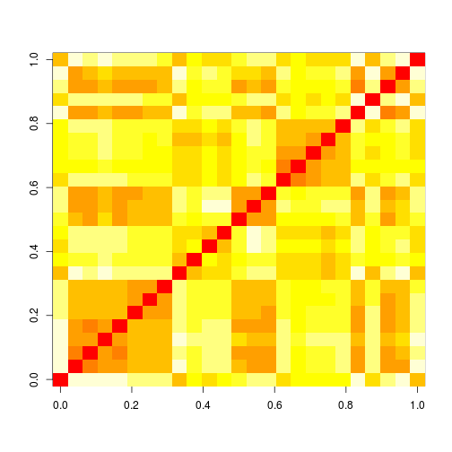

# Personality over time: an example with cMDS

In this example we'll use data from a personality study, "bfi" from package *psych*. People answered questions such as "I am full of ideas" with a rating of how well that describes their personality (from 1 to 6). 
We load the package:

```r
if (suppressWarnings(require(psych)) == FALSE) {
    install.packages("psych")
}
library(psych)
data(bfi)
head(bfi)
```

```
##       A1 A2 A3 A4 A5 C1 C2 C3 C4 C5 E1 E2 E3 E4 E5 N1 N2 N3 N4 N5 O1 O2 O3
## 61617  2  4  3  4  4  2  3  3  4  4  3  3  3  4  4  3  4  2  2  3  3  6  3
## 61618  2  4  5  2  5  5  4  4  3  4  1  1  6  4  3  3  3  3  5  5  4  2  4
## 61620  5  4  5  4  4  4  5  4  2  5  2  4  4  4  5  4  5  4  2  3  4  2  5
## 61621  4  4  6  5  5  4  4  3  5  5  5  3  4  4  4  2  5  2  4  1  3  3  4
## 61622  2  3  3  4  5  4  4  5  3  2  2  2  5  4  5  2  3  4  4  3  3  3  4
## 61623  6  6  5  6  5  6  6  6  1  3  2  1  6  5  6  3  5  2  2  3  4  3  5
##       O4 O5 gender education age
## 61617  4  3      1        NA  16
## 61618  3  3      2        NA  18
## 61620  5  2      2        NA  17
## 61621  3  5      2        NA  17
## 61622  3  3      1        NA  17
## 61623  6  1      2         3  21
```

The questions asked are coded in the data.frame as "A1","A2", etc. The help file for the dataset gives us the corresponding questions, which we encode as a list :

```r
questions = list(A1 = "Am indifferent to the feelings of others.", A2 = "Inquire about others' well-being.", 
    A3 = "Know how to comfort others.", A4 = "Love children.", A5 = "Make people feel at ease.", 
    C1 = "Am exacting in my work.", C2 = "Continue until everything is perfect.", 
    C3 = "Do things according to a plan.", C4 = "Do things in a half-way manner.", 
    C5 = "Waste my time.", E1 = "Won't talk a lot.", E2 = "Find it difficult to approach others.", 
    E3 = "Know how to captivate people.", E4 = "Make friends easily.", E5 = "Take charge.", 
    N1 = "Get angry easily.", N2 = "Get irritated easily.", N3 = "Have frequent mood swings.", 
    N4 = "Often feel blue.", N5 = "Panic easily.", O1 = "Am full of ideas.", 
    O2 = "Avoid difficult reading material.", O3 = "Carry the conversation to a higher level.", 
    O4 = "Spend time reflecting on things.", O5 = "Will not probe deeply into a subject.")
```


The data include the answers of around 3,000 participants. Participants' responses to a certain question can be grouped into a (long) response vector.
If two questions measure a similar aspect of personality, then the responses will tend to correlate: presumably, if you're cocky enough to declare that you "know how to captivate people", you'll probably also declare that you are "make friends easily". To start with, we'll measure the similarity of two response vectors using simple Euclidean distance. 

First we get rid of the rows that contain NAs

```r
nas <- apply(bfi, 1, function(v) any(is.na(v)))
sub <- bfi[!nas, ]
```

then we compute a distance matrix between all the response vectors:

```r
X <- t(sub[, 1:25])  #Questions only, no covariates
D <- as.matrix(dist(X))
image(t(D))
```

 


We can cluster the response vectors:

```r
plot(hclust(dist(X)))
```

 

the highest-level cluster is pretty straightforward to interpret:

```r
questions[which(cutree(hclust(dist(X)), 2) == 1)]
```

```
## $A1
## [1] "Am indifferent to the feelings of others."
## 
## $C4
## [1] "Do things in a half-way manner."
## 
## $C5
## [1] "Waste my time."
## 
## $E1
## [1] "Won't talk a lot."
## 
## $E2
## [1] "Find it difficult to approach others."
## 
## $N1
## [1] "Get angry easily."
## 
## $N2
## [1] "Get irritated easily."
## 
## $N3
## [1] "Have frequent mood swings."
## 
## $N4
## [1] "Often feel blue."
## 
## $N5
## [1] "Panic easily."
## 
## $O2
## [1] "Avoid difficult reading material."
## 
## $O5
## [1] "Will not probe deeply into a subject."
```

vs:

```r
questions[which(cutree(hclust(dist(X)), 2) == 2)]
```

```
## $A2
## [1] "Inquire about others' well-being."
## 
## $A3
## [1] "Know how to comfort others."
## 
## $A4
## [1] "Love children."
## 
## $A5
## [1] "Make people feel at ease."
## 
## $C1
## [1] "Am exacting in my work."
## 
## $C2
## [1] "Continue until everything is perfect."
## 
## $C3
## [1] "Do things according to a plan."
## 
## $E3
## [1] "Know how to captivate people."
## 
## $E4
## [1] "Make friends easily."
## 
## $E5
## [1] "Take charge."
## 
## $O1
## [1] "Am full of ideas."
## 
## $O3
## [1] "Carry the conversation to a higher level."
## 
## $O4
## [1] "Spend time reflecting on things."
```

This seems to suggest there are questions that people prefer to answer positively and others not. 

The bfi dataset also comes with a column vector that gives us the age of the participants. 

```r
hist(bfi$age)
```

 


We'll use cMDS to see if the relationship between questions changes over time. 

We define a function that gives a distance matrix between questions specific to a certain age group:


```r
dmat <- function(age.med) {
    sub.age <- subset(sub, abs(age - age.med) <= 2)
    X <- sub.age[, 1:25]
    as.matrix(dist(t(X)))/sqrt(nrow(X))
}
```


we collect distance matrices over a succession of age groups:

```r
ages <- seq(16, 60, l = 30)
DL <- llply(ages, dmat)  #Will output a list of distance matrices
names(DL) <- round(ages)  #This will be used later by the plotting function
```


and run cMDS to get a 2d embedding:

```r
library(cmdsr)
res <- cmds(DL, k = 2, l = 1)
```

```
## Total cost C:  244.3 
## The algorithm converged. (delta =  0.008888 )
```


The embedding can be displayed using the motion widget in the GoogleVis package:

```r
# Create a data.frame with some basic information on what's being displayed
df <- data.frame(id = names(questions), question = do.call("c", questions))
print(googleVis.cmds(res, df), "chart")
```

<!-- MotionChart generated in R 3.0.1 by googleVis 0.4.5 package -->
<!-- Wed Nov  6 15:54:46 2013 -->


<!-- jsHeader -->
<script type="text/javascript">
 
// jsData 
function gvisDataMotionChartID31bfb853f22 () {
var data = new google.visualization.DataTable();
var datajson =
[
 [
 "A1",
16,
-0.5553215918,
1.925550355,
"Am indifferent to the feelings of others." 
],
[
 "A1",
48,
-0.5390752771,
2.171398214,
"Am indifferent to the feelings of others." 
],
[
 "A1",
58,
0.1946546596,
2.329443829,
"Am indifferent to the feelings of others." 
],
[
 "A1",
36,
-0.8449331304,
1.970472817,
"Am indifferent to the feelings of others." 
],
[
 "A1",
24,
-0.5875643442,
1.940977615,
"Am indifferent to the feelings of others." 
],
[
 "A1",
55,
-0.16572847,
2.388306376,
"Am indifferent to the feelings of others." 
],
[
 "A1",
45,
-0.635835424,
2.135847812,
"Am indifferent to the feelings of others." 
],
[
 "A1",
43,
-0.6894577995,
2.13508364,
"Am indifferent to the feelings of others." 
],
[
 "A1",
31,
-0.8155222184,
1.981842041,
"Am indifferent to the feelings of others." 
],
[
 "A1",
42,
-0.7445679636,
2.139693262,
"Am indifferent to the feelings of others." 
],
[
 "A1",
19,
-0.5582965442,
1.904095434,
"Am indifferent to the feelings of others." 
],
[
 "A1",
51,
-0.4559817429,
2.272608727,
"Am indifferent to the feelings of others." 
],
[
 "A1",
39,
-0.81666918,
2.061001361,
"Am indifferent to the feelings of others." 
],
[
 "A1",
49,
-0.4975720402,
2.207244398,
"Am indifferent to the feelings of others." 
],
[
 "A1",
27,
-0.6603653619,
1.974684401,
"Am indifferent to the feelings of others." 
],
[
 "A1",
37,
-0.8327495117,
2.002881559,
"Am indifferent to the feelings of others." 
],
[
 "A1",
46,
-0.5864967852,
2.154256254,
"Am indifferent to the feelings of others." 
],
[
 "A1",
57,
0.00798400261,
2.361786105,
"Am indifferent to the feelings of others." 
],
[
 "A1",
34,
-0.8516359897,
1.969151025,
"Am indifferent to the feelings of others." 
],
[
 "A1",
52,
-0.3980702496,
2.346878888,
"Am indifferent to the feelings of others." 
],
[
 "A1",
54,
-0.3025447089,
2.392643621,
"Am indifferent to the feelings of others." 
],
[
 "A1",
22,
-0.5709442675,
1.921041763,
"Am indifferent to the feelings of others." 
],
[
 "A1",
21,
-0.5622690841,
1.908881584,
"Am indifferent to the feelings of others." 
],
[
 "A1",
60,
0.3722621958,
2.342634745,
"Am indifferent to the feelings of others." 
],
[
 "A1",
30,
-0.7734217019,
1.982752589,
"Am indifferent to the feelings of others." 
],
[
 "A1",
18,
-0.5572912561,
1.909472467,
"Am indifferent to the feelings of others." 
],
[
 "A1",
28,
-0.7174671552,
1.981757484,
"Am indifferent to the feelings of others." 
],
[
 "A1",
25,
-0.6168913984,
1.963040306,
"Am indifferent to the feelings of others." 
],
[
 "A1",
33,
-0.8434289683,
1.978548264,
"Am indifferent to the feelings of others." 
],
[
 "A1",
40,
-0.7885121665,
2.116343441,
"Am indifferent to the feelings of others." 
],
[
 "A2",
55,
0.133205206,
-1.80616997,
"Inquire about others' well-being." 
],
[
 "A2",
48,
0.05573528088,
-1.681228961,
"Inquire about others' well-being." 
],
[
 "A2",
46,
0.0692674056,
-1.696323348,
"Inquire about others' well-being." 
],
[
 "A2",
57,
0.07005327045,
-1.822471226,
"Inquire about others' well-being." 
],
[
 "A2",
34,
0.1060642821,
-1.71843946,
"Inquire about others' well-being." 
],
[
 "A2",
54,
0.1587809283,
-1.794815946,
"Inquire about others' well-being." 
],
[
 "A2",
31,
0.03179690674,
-1.693327429,
"Inquire about others' well-being." 
],
[
 "A2",
42,
0.1954914866,
-1.82444843,
"Inquire about others' well-being." 
],
[
 "A2",
40,
0.2249912629,
-1.824107448,
"Inquire about others' well-being." 
],
[
 "A2",
39,
0.2237386192,
-1.793730926,
"Inquire about others' well-being." 
],
[
 "A2",
49,
0.06533228887,
-1.704714959,
"Inquire about others' well-being." 
],
[
 "A2",
16,
-0.09196493117,
-1.62124428,
"Inquire about others' well-being." 
],
[
 "A2",
27,
0.03177908994,
-1.657984086,
"Inquire about others' well-being." 
],
[
 "A2",
58,
-0.009490126473,
-1.834962723,
"Inquire about others' well-being." 
],
[
 "A2",
36,
0.1567139198,
-1.720617463,
"Inquire about others' well-being." 
],
[
 "A2",
24,
0.03900472655,
-1.666804313,
"Inquire about others' well-being." 
],
[
 "A2",
21,
-0.003159710535,
-1.680150922,
"Inquire about others' well-being." 
],
[
 "A2",
33,
0.05913589934,
-1.712838161,
"Inquire about others' well-being." 
],
[
 "A2",
43,
0.1465572233,
-1.78797618,
"Inquire about others' well-being." 
],
[
 "A2",
18,
-0.06428576297,
-1.652542099,
"Inquire about others' well-being." 
],
[
 "A2",
28,
0.02428624921,
-1.658511852,
"Inquire about others' well-being." 
],
[
 "A2",
19,
-0.03475845902,
-1.674111328,
"Inquire about others' well-being." 
],
[
 "A2",
51,
0.1008796241,
-1.746524711,
"Inquire about others' well-being." 
],
[
 "A2",
25,
0.03882925875,
-1.663489181,
"Inquire about others' well-being." 
],
[
 "A2",
60,
-0.08344848256,
-1.852240225,
"Inquire about others' well-being." 
],
[
 "A2",
37,
0.1970486273,
-1.74932765,
"Inquire about others' well-being." 
],
[
 "A2",
22,
0.02465581087,
-1.673817428,
"Inquire about others' well-being." 
],
[
 "A2",
45,
0.09996504571,
-1.734459727,
"Inquire about others' well-being." 
],
[
 "A2",
30,
0.02227712652,
-1.669008158,
"Inquire about others' well-being." 
],
[
 "A2",
52,
0.1438727814,
-1.777827166,
"Inquire about others' well-being." 
],
[
 "A3",
24,
-0.3351695423,
-1.489747977,
"Know how to comfort others." 
],
[
 "A3",
46,
-0.4256376982,
-1.548919365,
"Know how to comfort others." 
],
[
 "A3",
57,
-0.7772919679,
-1.184744016,
"Know how to comfort others." 
],
[
 "A3",
54,
-0.7607128133,
-1.373976745,
"Know how to comfort others." 
],
[
 "A3",
31,
-0.4773696016,
-1.421008065,
"Know how to comfort others." 
],
[
 "A3",
43,
-0.4958245814,
-1.580569095,
"Know how to comfort others." 
],
[
 "A3",
51,
-0.5820580979,
-1.538661142,
"Know how to comfort others." 
],
[
 "A3",
39,
-0.6147620912,
-1.503617356,
"Know how to comfort others." 
],
[
 "A3",
16,
-0.5270340989,
-1.454907209,
"Know how to comfort others." 
],
[
 "A3",
48,
-0.4364133854,
-1.551346975,
"Know how to comfort others." 
],
[
 "A3",
58,
-0.7122058928,
-1.103976428,
"Know how to comfort others." 
],
[
 "A3",
25,
-0.3220183814,
-1.511444076,
"Know how to comfort others." 
],
[
 "A3",
36,
-0.632182047,
-1.363517901,
"Know how to comfort others." 
],
[
 "A3",
55,
-0.8000213463,
-1.274706611,
"Know how to comfort others." 
],
[
 "A3",
45,
-0.4524146372,
-1.557392411,
"Know how to comfort others." 
],
[
 "A3",
33,
-0.5472291973,
-1.372707244,
"Know how to comfort others." 
],
[
 "A3",
22,
-0.3643864831,
-1.476069652,
"Know how to comfort others." 
],
[
 "A3",
42,
-0.5372342034,
-1.587123995,
"Know how to comfort others." 
],
[
 "A3",
52,
-0.6765071774,
-1.467589588,
"Know how to comfort others." 
],
[
 "A3",
40,
-0.5762949414,
-1.561817322,
"Know how to comfort others." 
],
[
 "A3",
18,
-0.488245097,
-1.460977944,
"Know how to comfort others." 
],
[
 "A3",
49,
-0.4956448213,
-1.559583898,
"Know how to comfort others." 
],
[
 "A3",
60,
-0.654466766,
-1.083636538,
"Know how to comfort others." 
],
[
 "A3",
27,
-0.3249406922,
-1.520029812,
"Know how to comfort others." 
],
[
 "A3",
37,
-0.6364928479,
-1.430749942,
"Know how to comfort others." 
],
[
 "A3",
30,
-0.4041982976,
-1.46995536,
"Know how to comfort others." 
],
[
 "A3",
34,
-0.6016501337,
-1.345320351,
"Know how to comfort others." 
],
[
 "A3",
19,
-0.4473518801,
-1.467232405,
"Know how to comfort others." 
],
[
 "A3",
21,
-0.405509272,
-1.471877257,
"Know how to comfort others." 
],
[
 "A3",
28,
-0.3498053052,
-1.505953773,
"Know how to comfort others." 
],
[
 "A4",
36,
-0.5746692786,
-1.896619124,
"Love children." 
],
[
 "A4",
46,
-0.2711577763,
-1.947506352,
"Love children." 
],
[
 "A4",
43,
-0.2675562322,
-1.990191194,
"Love children." 
],
[
 "A4",
55,
-0.3066814373,
-1.975541877,
"Love children." 
],
[
 "A4",
54,
-0.2528658835,
-2.011937505,
"Love children." 
],
[
 "A4",
51,
-0.2091448669,
-1.9717407,
"Love children." 
],
[
 "A4",
16,
-1.580693975,
-1.00844193,
"Love children." 
],
[
 "A4",
48,
-0.2466509071,
-1.94207555,
"Love children." 
],
[
 "A4",
58,
-0.4470805112,
-1.79762545,
"Love children." 
],
[
 "A4",
25,
-0.9085605188,
-1.642481047,
"Love children." 
],
[
 "A4",
24,
-0.9699634184,
-1.604070305,
"Love children." 
],
[
 "A4",
34,
-0.7015739329,
-1.813645477,
"Love children." 
],
[
 "A4",
45,
-0.2794657352,
-1.961664376,
"Love children." 
],
[
 "A4",
22,
-1.066512689,
-1.540380242,
"Love children." 
],
[
 "A4",
31,
-0.8753506118,
-1.681119838,
"Love children." 
],
[
 "A4",
42,
-0.2547734573,
-2.017584547,
"Love children." 
],
[
 "A4",
19,
-1.327397935,
-1.319450544,
"Love children." 
],
[
 "A4",
30,
-0.8990036148,
-1.645316525,
"Love children." 
],
[
 "A4",
39,
-0.343945792,
-2.023465137,
"Love children." 
],
[
 "A4",
49,
-0.2226662197,
-1.946297749,
"Love children." 
],
[
 "A4",
27,
-0.8872362282,
-1.649309677,
"Love children." 
],
[
 "A4",
37,
-0.4502545244,
-1.978666201,
"Love children." 
],
[
 "A4",
33,
-0.8092609389,
-1.739579396,
"Love children." 
],
[
 "A4",
57,
-0.3768170223,
-1.897554738,
"Love children." 
],
[
 "A4",
21,
-1.190587277,
-1.446720777,
"Love children." 
],
[
 "A4",
52,
-0.216731027,
-2.002473899,
"Love children." 
],
[
 "A4",
40,
-0.2739095017,
-2.031693461,
"Love children." 
],
[
 "A4",
18,
-1.459638798,
-1.166274542,
"Love children." 
],
[
 "A4",
28,
-0.8924876424,
-1.641313726,
"Love children." 
],
[
 "A4",
60,
-0.5099229498,
-1.720291006,
"Love children." 
],
[
 "A5",
58,
-0.5962730502,
-1.494829168,
"Make people feel at ease." 
],
[
 "A5",
54,
-0.7942618857,
-1.623976638,
"Make people feel at ease." 
],
[
 "A5",
57,
-0.635116666,
-1.572087862,
"Make people feel at ease." 
],
[
 "A5",
55,
-0.7105819546,
-1.614986923,
"Make people feel at ease." 
],
[
 "A5",
60,
-0.5767483443,
-1.416524631,
"Make people feel at ease." 
],
[
 "A5",
16,
-0.4793208099,
-0.9905060618,
"Make people feel at ease." 
],
[
 "A5",
48,
-0.8615982021,
-1.449194993,
"Make people feel at ease." 
],
[
 "A5",
37,
-0.9854365101,
-1.315489028,
"Make people feel at ease." 
],
[
 "A5",
36,
-0.9724050057,
-1.261150615,
"Make people feel at ease." 
],
[
 "A5",
24,
-0.6673848157,
-1.14549126,
"Make people feel at ease." 
],
[
 "A5",
34,
-0.945967029,
-1.235535611,
"Make people feel at ease." 
],
[
 "A5",
45,
-0.9002300414,
-1.485076865,
"Make people feel at ease." 
],
[
 "A5",
43,
-0.9277104065,
-1.49077612,
"Make people feel at ease." 
],
[
 "A5",
31,
-0.840562676,
-1.20939467,
"Make people feel at ease." 
],
[
 "A5",
42,
-0.9467742735,
-1.470852655,
"Make people feel at ease." 
],
[
 "A5",
19,
-0.592229368,
-1.070346559,
"Make people feel at ease." 
],
[
 "A5",
51,
-0.8687022674,
-1.514896062,
"Make people feel at ease." 
],
[
 "A5",
39,
-0.9775476175,
-1.375350827,
"Make people feel at ease." 
],
[
 "A5",
49,
-0.860575454,
-1.461035348,
"Make people feel at ease." 
],
[
 "A5",
27,
-0.6901707519,
-1.176282569,
"Make people feel at ease." 
],
[
 "A5",
52,
-0.8513985308,
-1.584781113,
"Make people feel at ease." 
],
[
 "A5",
46,
-0.8783749881,
-1.469088924,
"Make people feel at ease." 
],
[
 "A5",
18,
-0.5406383387,
-1.029363017,
"Make people feel at ease." 
],
[
 "A5",
21,
-0.6307573703,
-1.102747492,
"Make people feel at ease." 
],
[
 "A5",
22,
-0.6543318165,
-1.126142811,
"Make people feel at ease." 
],
[
 "A5",
25,
-0.6763768476,
-1.165556938,
"Make people feel at ease." 
],
[
 "A5",
28,
-0.7214651825,
-1.181430937,
"Make people feel at ease." 
],
[
 "A5",
30,
-0.7744142662,
-1.189758822,
"Make people feel at ease." 
],
[
 "A5",
33,
-0.9000568627,
-1.224752979,
"Make people feel at ease." 
],
[
 "A5",
40,
-0.9622914483,
-1.431311183,
"Make people feel at ease." 
],
[
 "C1",
48,
1.037309294,
-1.28890871,
"Am exacting in my work." 
],
[
 "C1",
55,
0.717531576,
-1.336035722,
"Am exacting in my work." 
],
[
 "C1",
24,
0.9292207456,
-0.8246969142,
"Am exacting in my work." 
],
[
 "C1",
49,
1.059545841,
-1.305989687,
"Am exacting in my work." 
],
[
 "C1",
27,
0.9167111583,
-0.8584513393,
"Am exacting in my work." 
],
[
 "C1",
25,
0.9209396825,
-0.8408448246,
"Am exacting in my work." 
],
[
 "C1",
57,
0.5396172027,
-1.412137285,
"Am exacting in my work." 
],
[
 "C1",
34,
0.9432219498,
-1.207937086,
"Am exacting in my work." 
],
[
 "C1",
46,
0.9979977304,
-1.269185673,
"Am exacting in my work." 
],
[
 "C1",
33,
0.943162524,
-1.1491402,
"Am exacting in my work." 
],
[
 "C1",
31,
0.9371307526,
-1.060548112,
"Am exacting in my work." 
],
[
 "C1",
42,
0.8878717849,
-1.263110096,
"Am exacting in my work." 
],
[
 "C1",
54,
0.8725968287,
-1.305786753,
"Am exacting in my work." 
],
[
 "C1",
40,
0.8938512991,
-1.25489119,
"Am exacting in my work." 
],
[
 "C1",
39,
0.9119929288,
-1.253097887,
"Am exacting in my work." 
],
[
 "C1",
28,
0.919468583,
-0.8932589427,
"Am exacting in my work." 
],
[
 "C1",
16,
1.008884263,
-0.7004343764,
"Am exacting in my work." 
],
[
 "C1",
60,
0.2483502035,
-1.689241209,
"Am exacting in my work." 
],
[
 "C1",
58,
0.3778583074,
-1.534067776,
"Am exacting in my work." 
],
[
 "C1",
36,
0.9383902589,
-1.2355036,
"Am exacting in my work." 
],
[
 "C1",
18,
0.9784100053,
-0.7488739732,
"Am exacting in my work." 
],
[
 "C1",
21,
0.9393257289,
-0.8105570186,
"Am exacting in my work." 
],
[
 "C1",
45,
0.9428386767,
-1.262846103,
"Am exacting in my work." 
],
[
 "C1",
43,
0.9049768458,
-1.267091523,
"Am exacting in my work." 
],
[
 "C1",
22,
0.9344979696,
-0.8181155006,
"Am exacting in my work." 
],
[
 "C1",
19,
0.9526176381,
-0.7895866301,
"Am exacting in my work." 
],
[
 "C1",
51,
1.042468104,
-1.304373699,
"Am exacting in my work." 
],
[
 "C1",
30,
0.9278702998,
-0.9629092513,
"Am exacting in my work." 
],
[
 "C1",
37,
0.9295910477,
-1.252524668,
"Am exacting in my work." 
],
[
 "C1",
52,
0.9797238456,
-1.302774805,
"Am exacting in my work." 
],
[
 "C2",
24,
0.4194078248,
-0.6336750181,
"Continue until everything is perfect." 
],
[
 "C2",
39,
0.8813757079,
-0.7114592965,
"Continue until everything is perfect." 
],
[
 "C2",
16,
0.7651097048,
-0.7842326904,
"Continue until everything is perfect." 
],
[
 "C2",
36,
0.8990342383,
-0.843644916,
"Continue until everything is perfect." 
],
[
 "C2",
46,
0.8485299592,
-0.8430734626,
"Continue until everything is perfect." 
],
[
 "C2",
57,
1.40854101,
-0.5881561492,
"Continue until everything is perfect." 
],
[
 "C2",
43,
0.8293609605,
-0.7346951321,
"Continue until everything is perfect." 
],
[
 "C2",
54,
1.187065058,
-0.75489517,
"Continue until everything is perfect." 
],
[
 "C2",
31,
0.6822894874,
-0.7264013444,
"Continue until everything is perfect." 
],
[
 "C2",
55,
1.283115535,
-0.6862908635,
"Continue until everything is perfect." 
],
[
 "C2",
58,
1.571258958,
-0.4720951085,
"Continue until everything is perfect." 
],
[
 "C2",
51,
1.040755854,
-0.7971679381,
"Continue until everything is perfect." 
],
[
 "C2",
18,
0.6768313401,
-0.7314135829,
"Continue until everything is perfect." 
],
[
 "C2",
49,
0.9642448563,
-0.8276451394,
"Continue until everything is perfect." 
],
[
 "C2",
48,
0.8951558726,
-0.8531676299,
"Continue until everything is perfect." 
],
[
 "C2",
37,
0.8948748316,
-0.785912647,
"Continue until everything is perfect." 
],
[
 "C2",
25,
0.40105477,
-0.6380181528,
"Continue until everything is perfect." 
],
[
 "C2",
22,
0.4612552646,
-0.6399875905,
"Continue until everything is perfect." 
],
[
 "C2",
34,
0.8681468476,
-0.8536261492,
"Continue until everything is perfect." 
],
[
 "C2",
45,
0.8245249254,
-0.7968890152,
"Continue until everything is perfect." 
],
[
 "C2",
33,
0.7903335889,
-0.8002016034,
"Continue until everything is perfect." 
],
[
 "C2",
30,
0.5695206338,
-0.6666330579,
"Continue until everything is perfect." 
],
[
 "C2",
42,
0.8450281012,
-0.6844603421,
"Continue until everything is perfect." 
],
[
 "C2",
52,
1.112801879,
-0.7835338041,
"Continue until everything is perfect." 
],
[
 "C2",
40,
0.8636097195,
-0.6712371566,
"Continue until everything is perfect." 
],
[
 "C2",
19,
0.5942015321,
-0.6903684831,
"Continue until everything is perfect." 
],
[
 "C2",
60,
1.73776378,
-0.3741662654,
"Continue until everything is perfect." 
],
[
 "C2",
27,
0.4186703454,
-0.6386498121,
"Continue until everything is perfect." 
],
[
 "C2",
21,
0.5210163181,
-0.6586997419,
"Continue until everything is perfect." 
],
[
 "C2",
28,
0.4766522131,
-0.6419118212,
"Continue until everything is perfect." 
],
[
 "C3",
39,
0.3589736178,
-0.8192342424,
"Do things according to a plan." 
],
[
 "C3",
46,
0.4211696811,
-0.9686477662,
"Do things according to a plan." 
],
[
 "C3",
58,
0.9008551266,
-0.6918015172,
"Do things according to a plan." 
],
[
 "C3",
36,
0.2824925161,
-0.6618873182,
"Do things according to a plan." 
],
[
 "C3",
48,
0.4657179567,
-0.9680056092,
"Do things according to a plan." 
],
[
 "C3",
54,
0.6204950748,
-1.023264576,
"Do things according to a plan." 
],
[
 "C3",
43,
0.3512455037,
-0.9769306556,
"Do things according to a plan." 
],
[
 "C3",
55,
0.6875301335,
-0.9380146994,
"Do things according to a plan." 
],
[
 "C3",
40,
0.3598907183,
-0.88572167,
"Do things according to a plan." 
],
[
 "C3",
51,
0.535972545,
-1.017799426,
"Do things according to a plan." 
],
[
 "C3",
24,
-0.3324982943,
-0.4307105217,
"Do things according to a plan." 
],
[
 "C3",
16,
0.236105813,
-0.273673893,
"Do things according to a plan." 
],
[
 "C3",
27,
-0.3229206435,
-0.4304159064,
"Do things according to a plan." 
],
[
 "C3",
37,
0.3370461684,
-0.7481111476,
"Do things according to a plan." 
],
[
 "C3",
25,
-0.3433772866,
-0.4297869814,
"Do things according to a plan." 
],
[
 "C3",
57,
0.7816482632,
-0.8145326428,
"Do things according to a plan." 
],
[
 "C3",
34,
0.1899012529,
-0.5862657957,
"Do things according to a plan." 
],
[
 "C3",
45,
0.3752993802,
-0.9778799924,
"Do things according to a plan." 
],
[
 "C3",
22,
-0.2929243901,
-0.4432989742,
"Do things according to a plan." 
],
[
 "C3",
31,
-0.0598348605,
-0.463885643,
"Do things according to a plan." 
],
[
 "C3",
42,
0.351272266,
-0.9459384894,
"Do things according to a plan." 
],
[
 "C3",
19,
-0.09547936708,
-0.4220590873,
"Do things according to a plan." 
],
[
 "C3",
30,
-0.1774203634,
-0.4331556441,
"Do things according to a plan." 
],
[
 "C3",
18,
0.06126538313,
-0.3561799999,
"Do things according to a plan." 
],
[
 "C3",
49,
0.5011634098,
-0.9872582257,
"Do things according to a plan." 
],
[
 "C3",
60,
1.04845652,
-0.6291274737,
"Do things according to a plan." 
],
[
 "C3",
52,
0.5731420005,
-1.047411676,
"Do things according to a plan." 
],
[
 "C3",
33,
0.06880072328,
-0.5181622001,
"Do things according to a plan." 
],
[
 "C3",
21,
-0.2164437316,
-0.4487007252,
"Do things according to a plan." 
],
[
 "C3",
28,
-0.2685057581,
-0.4276787184,
"Do things according to a plan." 
],
[
 "C4",
46,
0.1300334224,
2.166205596,
"Do things in a half-way manner." 
],
[
 "C4",
48,
0.1267077002,
2.094442757,
"Do things in a half-way manner." 
],
[
 "C4",
58,
-0.480444374,
1.763942296,
"Do things in a half-way manner." 
],
[
 "C4",
54,
-0.07728635976,
2.017759291,
"Do things in a half-way manner." 
],
[
 "C4",
55,
-0.2067739707,
1.988252494,
"Do things in a half-way manner." 
],
[
 "C4",
52,
0.01730231315,
2.002648,
"Do things in a half-way manner." 
],
[
 "C4",
51,
0.07803540903,
1.979579176,
"Do things in a half-way manner." 
],
[
 "C4",
57,
-0.3501305552,
1.909027388,
"Do things in a half-way manner." 
],
[
 "C4",
49,
0.1114535811,
2.008120332,
"Do things in a half-way manner." 
],
[
 "C4",
60,
-0.6021334454,
1.591320433,
"Do things in a half-way manner." 
],
[
 "C4",
16,
0.1149902225,
1.799300682,
"Do things in a half-way manner." 
],
[
 "C4",
27,
0.02304418567,
1.92765898,
"Do things in a half-way manner." 
],
[
 "C4",
37,
-0.09254041999,
2.109873934,
"Do things in a half-way manner." 
],
[
 "C4",
36,
-0.1387769225,
2.108193888,
"Do things in a half-way manner." 
],
[
 "C4",
24,
0.07095699128,
1.838198746,
"Do things in a half-way manner." 
],
[
 "C4",
34,
-0.1474418159,
2.094222042,
"Do things in a half-way manner." 
],
[
 "C4",
45,
0.1208173487,
2.188457062,
"Do things in a half-way manner." 
],
[
 "C4",
43,
0.09710903802,
2.167834517,
"Do things in a half-way manner." 
],
[
 "C4",
31,
-0.08355337302,
2.025538919,
"Do things in a half-way manner." 
],
[
 "C4",
42,
0.06567343098,
2.122285582,
"Do things in a half-way manner." 
],
[
 "C4",
19,
0.1246246074,
1.835985075,
"Do things in a half-way manner." 
],
[
 "C4",
30,
-0.04494261129,
1.991969857,
"Do things in a half-way manner." 
],
[
 "C4",
39,
-0.03082251067,
2.093450864,
"Do things in a half-way manner." 
],
[
 "C4",
28,
-0.008612282282,
1.964181496,
"Do things in a half-way manner." 
],
[
 "C4",
21,
0.1145007772,
1.830339059,
"Do things in a half-way manner." 
],
[
 "C4",
25,
0.04783302817,
1.882987101,
"Do things in a half-way manner." 
],
[
 "C4",
18,
0.1232958141,
1.823276943,
"Do things in a half-way manner." 
],
[
 "C4",
22,
0.09438058176,
1.824615273,
"Do things in a half-way manner." 
],
[
 "C4",
33,
-0.122468102,
2.060483203,
"Do things in a half-way manner." 
],
[
 "C4",
40,
0.02279985912,
2.091064939,
"Do things in a half-way manner." 
],
[
 "C5",
48,
0.5678732105,
1.142417942,
"Waste my time." 
],
[
 "C5",
16,
0.776677843,
1.413347425,
"Waste my time." 
],
[
 "C5",
55,
0.7830185162,
0.8747047637,
"Waste my time." 
],
[
 "C5",
24,
1.042344648,
1.449418941,
"Waste my time." 
],
[
 "C5",
42,
-0.1926777607,
0.9011994958,
"Waste my time." 
],
[
 "C5",
46,
0.2902117778,
1.05711144,
"Waste my time." 
],
[
 "C5",
39,
-0.03901241883,
1.034446589,
"Waste my time." 
],
[
 "C5",
49,
0.8252991663,
1.215782736,
"Waste my time." 
],
[
 "C5",
27,
1.167684304,
1.444532406,
"Waste my time." 
],
[
 "C5",
54,
0.9924665255,
1.05120953,
"Waste my time." 
],
[
 "C5",
25,
1.111724193,
1.456005085,
"Waste my time." 
],
[
 "C5",
57,
0.4805696378,
0.6872970576,
"Waste my time." 
],
[
 "C5",
34,
0.6716531408,
1.4120811,
"Waste my time." 
],
[
 "C5",
58,
0.1205428658,
0.5044274016,
"Waste my time." 
],
[
 "C5",
33,
0.9093614752,
1.472185337,
"Waste my time." 
],
[
 "C5",
31,
1.078336137,
1.473307555,
"Waste my time." 
],
[
 "C5",
21,
0.9251168109,
1.457240613,
"Waste my time." 
],
[
 "C5",
19,
0.8769756535,
1.460514881,
"Waste my time." 
],
[
 "C5",
40,
-0.1634704162,
0.9351798086,
"Waste my time." 
],
[
 "C5",
18,
0.8298325114,
1.446370882,
"Waste my time." 
],
[
 "C5",
28,
1.192096964,
1.429963349,
"Waste my time." 
],
[
 "C5",
60,
-0.2579085014,
0.3245150058,
"Waste my time." 
],
[
 "C5",
37,
0.1587477599,
1.172326465,
"Waste my time." 
],
[
 "C5",
36,
0.4030428688,
1.302977431,
"Waste my time." 
],
[
 "C5",
22,
0.9787904384,
1.449169514,
"Waste my time." 
],
[
 "C5",
45,
0.0455436978,
0.9775822422,
"Waste my time." 
],
[
 "C5",
43,
-0.1223366048,
0.9219478702,
"Waste my time." 
],
[
 "C5",
30,
1.168330171,
1.442459863,
"Waste my time." 
],
[
 "C5",
52,
1.072468264,
1.182888689,
"Waste my time." 
],
[
 "C5",
51,
1.008697706,
1.237842622,
"Waste my time." 
],
[
 "E1",
16,
-1.606479778,
0.5506775327,
"Won't talk a lot." 
],
[
 "E1",
24,
-1.679397374,
0.7116013884,
"Won't talk a lot." 
],
[
 "E1",
31,
-1.634433766,
0.7815118343,
"Won't talk a lot." 
],
[
 "E1",
36,
-1.615412485,
0.8123474442,
"Won't talk a lot." 
],
[
 "E1",
39,
-1.600825132,
0.7875463325,
"Won't talk a lot." 
],
[
 "E1",
49,
-1.644058029,
0.8209787805,
"Won't talk a lot." 
],
[
 "E1",
48,
-1.676935834,
0.8242560393,
"Won't talk a lot." 
],
[
 "E1",
43,
-1.630405878,
0.7767445953,
"Won't talk a lot." 
],
[
 "E1",
46,
-1.690936664,
0.8176233838,
"Won't talk a lot." 
],
[
 "E1",
57,
-1.485533145,
0.7442850051,
"Won't talk a lot." 
],
[
 "E1",
55,
-1.458328926,
0.7376278419,
"Won't talk a lot." 
],
[
 "E1",
51,
-1.607059948,
0.7956564534,
"Won't talk a lot." 
],
[
 "E1",
54,
-1.501425458,
0.7432147535,
"Won't talk a lot." 
],
[
 "E1",
22,
-1.663648071,
0.6899843548,
"Won't talk a lot." 
],
[
 "E1",
42,
-1.603871114,
0.7575676522,
"Won't talk a lot." 
],
[
 "E1",
58,
-1.566787185,
0.7626557028,
"Won't talk a lot." 
],
[
 "E1",
30,
-1.658529272,
0.7691512054,
"Won't talk a lot." 
],
[
 "E1",
18,
-1.609807532,
0.5913501998,
"Won't talk a lot." 
],
[
 "E1",
28,
-1.680980628,
0.765663058,
"Won't talk a lot." 
],
[
 "E1",
27,
-1.690754412,
0.7557598983,
"Won't talk a lot." 
],
[
 "E1",
37,
-1.607398734,
0.8059991446,
"Won't talk a lot." 
],
[
 "E1",
25,
-1.690165495,
0.7373169592,
"Won't talk a lot." 
],
[
 "E1",
19,
-1.621315433,
0.6332011399,
"Won't talk a lot." 
],
[
 "E1",
34,
-1.617769387,
0.8125914391,
"Won't talk a lot." 
],
[
 "E1",
45,
-1.667322663,
0.7975596879,
"Won't talk a lot." 
],
[
 "E1",
33,
-1.62139329,
0.8010834672,
"Won't talk a lot." 
],
[
 "E1",
52,
-1.564350929,
0.7641770504,
"Won't talk a lot." 
],
[
 "E1",
40,
-1.596934666,
0.7671997217,
"Won't talk a lot." 
],
[
 "E1",
60,
-1.674601278,
0.797855129,
"Won't talk a lot." 
],
[
 "E1",
21,
-1.641137974,
0.6664616901,
"Won't talk a lot." 
],
[
 "E2",
46,
-0.5356266476,
1.197850633,
"Find it difficult to approach others." 
],
[
 "E2",
31,
-0.309484884,
1.343367654,
"Find it difficult to approach others." 
],
[
 "E2",
54,
-1.466447929,
1.014452038,
"Find it difficult to approach others." 
],
[
 "E2",
39,
-0.1397454011,
1.549095054,
"Find it difficult to approach others." 
],
[
 "E2",
40,
-0.1359371124,
1.574437983,
"Find it difficult to approach others." 
],
[
 "E2",
58,
-1.27727148,
1.057399202,
"Find it difficult to approach others." 
],
[
 "E2",
36,
-0.1874116078,
1.423930435,
"Find it difficult to approach others." 
],
[
 "E2",
16,
-0.7929679807,
0.8238066578,
"Find it difficult to approach others." 
],
[
 "E2",
48,
-0.7451454259,
1.002201873,
"Find it difficult to approach others." 
],
[
 "E2",
33,
-0.2597715742,
1.372630769,
"Find it difficult to approach others." 
],
[
 "E2",
43,
-0.2276838108,
1.529310203,
"Find it difficult to approach others." 
],
[
 "E2",
24,
-0.5344760568,
1.126346918,
"Find it difficult to approach others." 
],
[
 "E2",
55,
-1.452775736,
1.0470378,
"Find it difficult to approach others." 
],
[
 "E2",
19,
-0.6657408293,
0.9447168427,
"Find it difficult to approach others." 
],
[
 "E2",
51,
-1.218405618,
0.8942030781,
"Find it difficult to approach others." 
],
[
 "E2",
18,
-0.727376002,
0.8789327658,
"Find it difficult to approach others." 
],
[
 "E2",
49,
-0.9860807529,
0.8997291579,
"Find it difficult to approach others." 
],
[
 "E2",
27,
-0.457160021,
1.221779449,
"Find it difficult to approach others." 
],
[
 "E2",
37,
-0.1594973449,
1.490264178,
"Find it difficult to approach others." 
],
[
 "E2",
25,
-0.4958979449,
1.17392044,
"Find it difficult to approach others." 
],
[
 "E2",
57,
-1.377755229,
1.051926544,
"Find it difficult to approach others." 
],
[
 "E2",
34,
-0.220017388,
1.390838175,
"Find it difficult to approach others." 
],
[
 "E2",
45,
-0.3569549611,
1.398924143,
"Find it difficult to approach others." 
],
[
 "E2",
22,
-0.5729658813,
1.074006346,
"Find it difficult to approach others." 
],
[
 "E2",
42,
-0.1584602045,
1.571465442,
"Find it difficult to approach others." 
],
[
 "E2",
52,
-1.387542035,
0.95579764,
"Find it difficult to approach others." 
],
[
 "E2",
30,
-0.3653589191,
1.304930557,
"Find it difficult to approach others." 
],
[
 "E2",
28,
-0.4148832669,
1.266905553,
"Find it difficult to approach others." 
],
[
 "E2",
60,
-1.190249097,
1.098819975,
"Find it difficult to approach others." 
],
[
 "E2",
21,
-0.6144433651,
1.012038713,
"Find it difficult to approach others." 
],
[
 "E3",
43,
-0.9263942487,
-0.4273208837,
"Know how to captivate people." 
],
[
 "E3",
51,
-0.8884820374,
-0.4858067829,
"Know how to captivate people." 
],
[
 "E3",
48,
-0.8942666444,
-0.3962490669,
"Know how to captivate people." 
],
[
 "E3",
58,
-0.549200328,
-0.4415980853,
"Know how to captivate people." 
],
[
 "E3",
46,
-0.8940636683,
-0.413698936,
"Know how to captivate people." 
],
[
 "E3",
55,
-0.7520598671,
-0.4741558769,
"Know how to captivate people." 
],
[
 "E3",
45,
-0.9021692913,
-0.439199588,
"Know how to captivate people." 
],
[
 "E3",
54,
-0.8120362981,
-0.5234753054,
"Know how to captivate people." 
],
[
 "E3",
57,
-0.6589465094,
-0.4364493508,
"Know how to captivate people." 
],
[
 "E3",
42,
-0.9461171092,
-0.3867075273,
"Know how to captivate people." 
],
[
 "E3",
52,
-0.8592220246,
-0.5324437974,
"Know how to captivate people." 
],
[
 "E3",
40,
-0.9401492492,
-0.3693081223,
"Know how to captivate people." 
],
[
 "E3",
39,
-0.9127936627,
-0.4031986433,
"Know how to captivate people." 
],
[
 "E3",
49,
-0.8981403266,
-0.4259643731,
"Know how to captivate people." 
],
[
 "E3",
60,
-0.4446221874,
-0.4757485239,
"Know how to captivate people." 
],
[
 "E3",
16,
-0.6704529305,
-0.4617914713,
"Know how to captivate people." 
],
[
 "E3",
27,
-0.8135514742,
-0.592436511,
"Know how to captivate people." 
],
[
 "E3",
37,
-0.8675252914,
-0.4603415585,
"Know how to captivate people." 
],
[
 "E3",
36,
-0.8166432057,
-0.5205068899,
"Know how to captivate people." 
],
[
 "E3",
24,
-0.8371750903,
-0.5199826652,
"Know how to captivate people." 
],
[
 "E3",
34,
-0.7843329793,
-0.56898695,
"Know how to captivate people." 
],
[
 "E3",
19,
-0.7622927574,
-0.4644676774,
"Know how to captivate people." 
],
[
 "E3",
22,
-0.8261513778,
-0.486585873,
"Know how to captivate people." 
],
[
 "E3",
31,
-0.7739060296,
-0.5942222727,
"Know how to captivate people." 
],
[
 "E3",
21,
-0.8003061669,
-0.4700460184,
"Know how to captivate people." 
],
[
 "E3",
30,
-0.7822858817,
-0.5907443277,
"Know how to captivate people." 
],
[
 "E3",
18,
-0.7185442387,
-0.4611087391,
"Know how to captivate people." 
],
[
 "E3",
28,
-0.7977445501,
-0.5958193708,
"Know how to captivate people." 
],
[
 "E3",
25,
-0.8289376655,
-0.5653236403,
"Know how to captivate people." 
],
[
 "E3",
33,
-0.7699703494,
-0.5925250028,
"Know how to captivate people." 
],
[
 "E4",
55,
-1.322126674,
-1.090543407,
"Make friends easily." 
],
[
 "E4",
16,
-0.8522384006,
-1.147323224,
"Make friends easily." 
],
[
 "E4",
48,
-1.459494313,
-1.074538985,
"Make friends easily." 
],
[
 "E4",
46,
-1.413973896,
-1.12399625,
"Make friends easily." 
],
[
 "E4",
24,
-1.220790649,
-1.030643311,
"Make friends easily." 
],
[
 "E4",
34,
-1.264622836,
-0.9820241221,
"Make friends easily." 
],
[
 "E4",
54,
-1.446748476,
-0.9799151654,
"Make friends easily." 
],
[
 "E4",
31,
-1.271481579,
-1.002603334,
"Make friends easily." 
],
[
 "E4",
42,
-1.264871782,
-1.117581382,
"Make friends easily." 
],
[
 "E4",
19,
-1.042966246,
-1.095057185,
"Make friends easily." 
],
[
 "E4",
51,
-1.511763215,
-0.9440218594,
"Make friends easily." 
],
[
 "E4",
39,
-1.21771377,
-1.065832134,
"Make friends easily." 
],
[
 "E4",
49,
-1.486958154,
-1.008320632,
"Make friends easily." 
],
[
 "E4",
27,
-1.243283888,
-1.026658739,
"Make friends easily." 
],
[
 "E4",
58,
-1.060826618,
-1.317830635,
"Make friends easily." 
],
[
 "E4",
25,
-1.235321886,
-1.031466553,
"Make friends easily." 
],
[
 "E4",
57,
-1.182658084,
-1.210449188,
"Make friends easily." 
],
[
 "E4",
21,
-1.125204403,
-1.065312348,
"Make friends easily." 
],
[
 "E4",
52,
-1.513260407,
-0.9233479946,
"Make friends easily." 
],
[
 "E4",
33,
-1.272516058,
-0.9958451621,
"Make friends easily." 
],
[
 "E4",
43,
-1.305999681,
-1.145590259,
"Make friends easily." 
],
[
 "E4",
28,
-1.25056064,
-1.013499052,
"Make friends easily." 
],
[
 "E4",
60,
-0.9824363734,
-1.434785844,
"Make friends easily." 
],
[
 "E4",
40,
-1.233180279,
-1.090399094,
"Make friends easily." 
],
[
 "E4",
18,
-0.9523770671,
-1.122537169,
"Make friends easily." 
],
[
 "E4",
36,
-1.246305271,
-0.9914134282,
"Make friends easily." 
],
[
 "E4",
37,
-1.22499601,
-1.033642872,
"Make friends easily." 
],
[
 "E4",
22,
-1.185437777,
-1.041019453,
"Make friends easily." 
],
[
 "E4",
45,
-1.354451494,
-1.148159874,
"Make friends easily." 
],
[
 "E4",
30,
-1.262019453,
-1.001727004,
"Make friends easily." 
],
[
 "E5",
55,
0.01817853461,
-1.344808909,
"Take charge." 
],
[
 "E5",
16,
-0.03160994108,
-0.8916281562,
"Take charge." 
],
[
 "E5",
36,
-0.08884749533,
-1.336022796,
"Take charge." 
],
[
 "E5",
24,
0.02226820721,
-1.040607075,
"Take charge." 
],
[
 "E5",
43,
-0.3896650881,
-1.112241898,
"Take charge." 
],
[
 "E5",
31,
-0.04037088509,
-1.304418176,
"Take charge." 
],
[
 "E5",
42,
-0.3166019693,
-1.169016717,
"Take charge." 
],
[
 "E5",
57,
0.1572585154,
-1.295034587,
"Take charge." 
],
[
 "E5",
51,
-0.4233183636,
-1.150802266,
"Take charge." 
],
[
 "E5",
39,
-0.1881489808,
-1.268027984,
"Take charge." 
],
[
 "E5",
49,
-0.5023118903,
-1.031576295,
"Take charge." 
],
[
 "E5",
48,
-0.5249783387,
-0.9564896168,
"Take charge." 
],
[
 "E5",
58,
0.2833302574,
-1.204511538,
"Take charge." 
],
[
 "E5",
46,
-0.5087423733,
-0.9678996477,
"Take charge." 
],
[
 "E5",
18,
-0.03458245907,
-0.9145963474,
"Take charge." 
],
[
 "E5",
34,
-0.0592573003,
-1.359782231,
"Take charge." 
],
[
 "E5",
54,
-0.1387847107,
-1.339091057,
"Take charge." 
],
[
 "E5",
22,
0.006625928163,
-1.006907367,
"Take charge." 
],
[
 "E5",
25,
0.0239141991,
-1.085392799,
"Take charge." 
],
[
 "E5",
21,
-0.0139959688,
-0.9766648452,
"Take charge." 
],
[
 "E5",
19,
-0.02913712574,
-0.9461697306,
"Take charge." 
],
[
 "E5",
30,
-0.03006895827,
-1.231405682,
"Take charge." 
],
[
 "E5",
33,
-0.04671340445,
-1.352783398,
"Take charge." 
],
[
 "E5",
28,
-0.01139072278,
-1.171685643,
"Take charge." 
],
[
 "E5",
27,
0.01120647485,
-1.126432492,
"Take charge." 
],
[
 "E5",
37,
-0.1351225485,
-1.306853208,
"Take charge." 
],
[
 "E5",
40,
-0.2451965841,
-1.219989634,
"Take charge." 
],
[
 "E5",
45,
-0.4582320347,
-1.036082769,
"Take charge." 
],
[
 "E5",
52,
-0.2925730618,
-1.269337684,
"Take charge." 
],
[
 "E5",
60,
0.4218126914,
-1.110577311,
"Take charge." 
],
[
 "N1",
25,
1.430473976,
0.9270360657,
"Get angry easily." 
],
[
 "N1",
24,
1.430229571,
0.9849037495,
"Get angry easily." 
],
[
 "N1",
46,
1.017285616,
1.531292114,
"Get angry easily." 
],
[
 "N1",
33,
1.346097084,
0.9648766318,
"Get angry easily." 
],
[
 "N1",
31,
1.378696822,
0.8810566008,
"Get angry easily." 
],
[
 "N1",
54,
0.6791572269,
1.595601947,
"Get angry easily." 
],
[
 "N1",
40,
1.186510678,
1.330882187,
"Get angry easily." 
],
[
 "N1",
39,
1.192635482,
1.299411335,
"Get angry easily." 
],
[
 "N1",
16,
1.212118816,
1.150101478,
"Get angry easily." 
],
[
 "N1",
48,
0.8912909973,
1.572786027,
"Get angry easily." 
],
[
 "N1",
58,
0.9451956865,
1.508608329,
"Get angry easily." 
],
[
 "N1",
36,
1.257838917,
1.187346565,
"Get angry easily." 
],
[
 "N1",
57,
0.8398135541,
1.530063484,
"Get angry easily." 
],
[
 "N1",
55,
0.7461744192,
1.559605576,
"Get angry easily." 
],
[
 "N1",
45,
1.113612116,
1.489718313,
"Get angry easily." 
],
[
 "N1",
43,
1.16772315,
1.443713365,
"Get angry easily." 
],
[
 "N1",
18,
1.273088558,
1.153632237,
"Get angry easily." 
],
[
 "N1",
42,
1.186673204,
1.384215774,
"Get angry easily." 
],
[
 "N1",
19,
1.330541208,
1.146739502,
"Get angry easily." 
],
[
 "N1",
51,
0.6805555059,
1.606212638,
"Get angry easily." 
],
[
 "N1",
22,
1.416490807,
1.052074603,
"Get angry easily." 
],
[
 "N1",
49,
0.7651192589,
1.603240259,
"Get angry easily." 
],
[
 "N1",
27,
1.42347239,
0.8773847354,
"Get angry easily." 
],
[
 "N1",
37,
1.215885019,
1.261461617,
"Get angry easily." 
],
[
 "N1",
30,
1.402365431,
0.8406769058,
"Get angry easily." 
],
[
 "N1",
34,
1.305436132,
1.083194042,
"Get angry easily." 
],
[
 "N1",
52,
0.6544057228,
1.607461905,
"Get angry easily." 
],
[
 "N1",
21,
1.381973565,
1.113006944,
"Get angry easily." 
],
[
 "N1",
60,
1.065532572,
1.519510527,
"Get angry easily." 
],
[
 "N1",
28,
1.416324585,
0.8425026847,
"Get angry easily." 
],
[
 "N2",
36,
1.205938569,
0.4056001993,
"Get irritated easily." 
],
[
 "N2",
43,
1.325408582,
0.7151081105,
"Get irritated easily." 
],
[
 "N2",
54,
1.450727393,
0.7073375775,
"Get irritated easily." 
],
[
 "N2",
58,
1.299154517,
0.9239406717,
"Get irritated easily." 
],
[
 "N2",
51,
1.453232039,
0.6593101982,
"Get irritated easily." 
],
[
 "N2",
55,
1.412205117,
0.7688574061,
"Get irritated easily." 
],
[
 "N2",
48,
1.446422278,
0.7270253835,
"Get irritated easily." 
],
[
 "N2",
37,
1.178280383,
0.4378270573,
"Get irritated easily." 
],
[
 "N2",
46,
1.432747343,
0.7591817166,
"Get irritated easily." 
],
[
 "N2",
57,
1.359287088,
0.8411877405,
"Get irritated easily." 
],
[
 "N2",
34,
1.2398298,
0.3770979713,
"Get irritated easily." 
],
[
 "N2",
45,
1.391332864,
0.7622696829,
"Get irritated easily." 
],
[
 "N2",
33,
1.268433643,
0.3481794474,
"Get irritated easily." 
],
[
 "N2",
31,
1.28117582,
0.3234849892,
"Get irritated easily." 
],
[
 "N2",
42,
1.248986632,
0.6172105834,
"Get irritated easily." 
],
[
 "N2",
52,
1.464658943,
0.6655642662,
"Get irritated easily." 
],
[
 "N2",
40,
1.188903961,
0.5193195481,
"Get irritated easily." 
],
[
 "N2",
39,
1.167719992,
0.4632729214,
"Get irritated easily." 
],
[
 "N2",
49,
1.447525331,
0.6873724086,
"Get irritated easily." 
],
[
 "N2",
60,
1.245313654,
1.025750803,
"Get irritated easily." 
],
[
 "N2",
16,
0.9883773696,
0.4155448077,
"Get irritated easily." 
],
[
 "N2",
27,
1.311489316,
0.2759078106,
"Get irritated easily." 
],
[
 "N2",
19,
1.159608245,
0.3967219594,
"Get irritated easily." 
],
[
 "N2",
25,
1.330260616,
0.2782447892,
"Get irritated easily." 
],
[
 "N2",
24,
1.329983763,
0.293280541,
"Get irritated easily." 
],
[
 "N2",
21,
1.240338254,
0.3632870083,
"Get irritated easily." 
],
[
 "N2",
22,
1.301328999,
0.32370995,
"Get irritated easily." 
],
[
 "N2",
18,
1.076089133,
0.4139328714,
"Get irritated easily." 
],
[
 "N2",
28,
1.289719545,
0.2850006602,
"Get irritated easily." 
],
[
 "N2",
30,
1.281365136,
0.2989746925,
"Get irritated easily." 
],
[
 "N3",
48,
1.280838328,
1.07540369,
"Have frequent mood swings." 
],
[
 "N3",
55,
1.088236878,
1.504553405,
"Have frequent mood swings." 
],
[
 "N3",
43,
1.364166862,
1.010788652,
"Have frequent mood swings." 
],
[
 "N3",
24,
1.058701641,
0.6679628019,
"Have frequent mood swings." 
],
[
 "N3",
16,
1.492165151,
0.5649912251,
"Have frequent mood swings." 
],
[
 "N3",
27,
0.9193275343,
0.7469742269,
"Have frequent mood swings." 
],
[
 "N3",
58,
0.7673124188,
1.47744898,
"Have frequent mood swings." 
],
[
 "N3",
46,
1.301999042,
1.027499316,
"Have frequent mood swings." 
],
[
 "N3",
57,
0.9464474177,
1.493397693,
"Have frequent mood swings." 
],
[
 "N3",
34,
1.078627778,
0.8251372349,
"Have frequent mood swings." 
],
[
 "N3",
45,
1.334217373,
1.020190114,
"Have frequent mood swings." 
],
[
 "N3",
54,
1.200983608,
1.500015099,
"Have frequent mood swings." 
],
[
 "N3",
31,
0.9005168123,
0.799241221,
"Have frequent mood swings." 
],
[
 "N3",
42,
1.383797825,
0.9825089565,
"Have frequent mood swings." 
],
[
 "N3",
19,
1.368958142,
0.6342784949,
"Have frequent mood swings." 
],
[
 "N3",
51,
1.287414368,
1.320771586,
"Have frequent mood swings." 
],
[
 "N3",
39,
1.360913417,
0.9404225651,
"Have frequent mood swings." 
],
[
 "N3",
49,
1.28026144,
1.185459795,
"Have frequent mood swings." 
],
[
 "N3",
60,
0.6001105879,
1.49763056,
"Have frequent mood swings." 
],
[
 "N3",
52,
1.269607076,
1.439655746,
"Have frequent mood swings." 
],
[
 "N3",
25,
0.9816569442,
0.708584434,
"Have frequent mood swings." 
],
[
 "N3",
36,
1.194959944,
0.8644127192,
"Have frequent mood swings." 
],
[
 "N3",
21,
1.268426571,
0.6475725835,
"Have frequent mood swings." 
],
[
 "N3",
33,
0.9746868077,
0.807027731,
"Have frequent mood swings." 
],
[
 "N3",
22,
1.157427696,
0.649696234,
"Have frequent mood swings." 
],
[
 "N3",
28,
0.8779104209,
0.7723195253,
"Have frequent mood swings." 
],
[
 "N3",
40,
1.385098513,
0.9549909094,
"Have frequent mood swings." 
],
[
 "N3",
18,
1.442025583,
0.6031685836,
"Have frequent mood swings." 
],
[
 "N3",
30,
0.868127838,
0.787747632,
"Have frequent mood swings." 
],
[
 "N3",
37,
1.297988997,
0.9154779114,
"Have frequent mood swings." 
],
[
 "N4",
48,
0.8061486516,
0.6659797548,
"Often feel blue." 
],
[
 "N4",
55,
0.4376944004,
1.25543916,
"Often feel blue." 
],
[
 "N4",
49,
0.7350390956,
0.7703788076,
"Often feel blue." 
],
[
 "N4",
16,
0.6931283761,
1.022797013,
"Often feel blue." 
],
[
 "N4",
57,
0.455427857,
1.135593097,
"Often feel blue." 
],
[
 "N4",
36,
0.600956083,
0.9423516353,
"Often feel blue." 
],
[
 "N4",
24,
0.3213064426,
0.9802072852,
"Often feel blue." 
],
[
 "N4",
34,
0.4790311045,
1.003576699,
"Often feel blue." 
],
[
 "N4",
46,
0.8669669307,
0.688478724,
"Often feel blue." 
],
[
 "N4",
43,
0.8993295137,
0.8954359287,
"Often feel blue." 
],
[
 "N4",
31,
0.3175546486,
1.091908013,
"Often feel blue." 
],
[
 "N4",
42,
0.875638537,
0.945138024,
"Often feel blue." 
],
[
 "N4",
54,
0.4821064923,
1.246451423,
"Often feel blue." 
],
[
 "N4",
51,
0.6520032001,
0.9487187629,
"Often feel blue." 
],
[
 "N4",
39,
0.7896187152,
0.9363244304,
"Often feel blue." 
],
[
 "N4",
28,
0.283020008,
1.077498118,
"Often feel blue." 
],
[
 "N4",
27,
0.2787369871,
1.071506179,
"Often feel blue." 
],
[
 "N4",
58,
0.5181878635,
0.9130754965,
"Often feel blue." 
],
[
 "N4",
25,
0.2862471356,
1.036574156,
"Often feel blue." 
],
[
 "N4",
18,
0.6454409279,
1.008488581,
"Often feel blue." 
],
[
 "N4",
21,
0.4955467625,
0.9664852086,
"Often feel blue." 
],
[
 "N4",
45,
0.8987443636,
0.7916460911,
"Often feel blue." 
],
[
 "N4",
22,
0.3970441791,
0.9547354757,
"Often feel blue." 
],
[
 "N4",
33,
0.3776735963,
1.06896511,
"Often feel blue." 
],
[
 "N4",
19,
0.5827871148,
0.9904113441,
"Often feel blue." 
],
[
 "N4",
30,
0.2920949909,
1.079328214,
"Often feel blue." 
],
[
 "N4",
40,
0.8392300532,
0.9501954963,
"Often feel blue." 
],
[
 "N4",
60,
0.5978130493,
0.673492611,
"Often feel blue." 
],
[
 "N4",
37,
0.7132202988,
0.9279793897,
"Often feel blue." 
],
[
 "N4",
52,
0.5622233498,
1.125469094,
"Often feel blue." 
],
[
 "N5",
24,
0.4903966321,
1.431645662,
"Panic easily." 
],
[
 "N5",
39,
0.7986483781,
1.646285595,
"Panic easily." 
],
[
 "N5",
46,
0.3270269311,
1.54894641,
"Panic easily." 
],
[
 "N5",
25,
0.5599879647,
1.481410323,
"Panic easily." 
],
[
 "N5",
57,
-0.1296853075,
1.53801125,
"Panic easily." 
],
[
 "N5",
54,
-0.1465799102,
1.512111255,
"Panic easily." 
],
[
 "N5",
33,
0.596439923,
1.66738074,
"Panic easily." 
],
[
 "N5",
31,
0.5891801703,
1.635708593,
"Panic easily." 
],
[
 "N5",
55,
-0.1426957348,
1.529223725,
"Panic easily." 
],
[
 "N5",
58,
-0.1005058891,
1.511232543,
"Panic easily." 
],
[
 "N5",
40,
0.791752379,
1.64118784,
"Panic easily." 
],
[
 "N5",
18,
0.03225692987,
1.115341468,
"Panic easily." 
],
[
 "N5",
16,
-0.05498115799,
1.053582785,
"Panic easily." 
],
[
 "N5",
60,
-0.05869925849,
1.469517557,
"Panic easily." 
],
[
 "N5",
48,
0.1535486731,
1.487152557,
"Panic easily." 
],
[
 "N5",
37,
0.7604613368,
1.653180331,
"Panic easily." 
],
[
 "N5",
36,
0.6961279577,
1.659353678,
"Panic easily." 
],
[
 "N5",
22,
0.3843222577,
1.367600614,
"Panic easily." 
],
[
 "N5",
34,
0.6343856581,
1.6718059,
"Panic easily." 
],
[
 "N5",
45,
0.4969263262,
1.602225041,
"Panic easily." 
],
[
 "N5",
43,
0.6348782377,
1.633128929,
"Panic easily." 
],
[
 "N5",
30,
0.5987707682,
1.583941143,
"Panic easily." 
],
[
 "N5",
42,
0.7357742857,
1.643506292,
"Panic easily." 
],
[
 "N5",
19,
0.1352540492,
1.195853829,
"Panic easily." 
],
[
 "N5",
51,
-0.07055070952,
1.456504721,
"Panic easily." 
],
[
 "N5",
49,
0.01986331739,
1.45140621,
"Panic easily." 
],
[
 "N5",
27,
0.5942175792,
1.513864858,
"Panic easily." 
],
[
 "N5",
52,
-0.1259412162,
1.483821609,
"Panic easily." 
],
[
 "N5",
21,
0.2559788745,
1.283822691,
"Panic easily." 
],
[
 "N5",
28,
0.6053752122,
1.545068634,
"Panic easily." 
],
[
 "O1",
36,
0.6249582998,
-1.609175512,
"Am full of ideas." 
],
[
 "O1",
43,
0.5968715319,
-1.651207221,
"Am full of ideas." 
],
[
 "O1",
46,
0.6032708608,
-1.731467118,
"Am full of ideas." 
],
[
 "O1",
48,
0.5782437629,
-1.700049915,
"Am full of ideas." 
],
[
 "O1",
51,
0.549372616,
-1.673096194,
"Am full of ideas." 
],
[
 "O1",
54,
0.6215546542,
-1.688817795,
"Am full of ideas." 
],
[
 "O1",
55,
0.7016650229,
-1.651373262,
"Am full of ideas." 
],
[
 "O1",
58,
0.9354998815,
-1.470647341,
"Am full of ideas." 
],
[
 "O1",
30,
0.7174595653,
-1.570689166,
"Am full of ideas." 
],
[
 "O1",
24,
0.6382360144,
-1.494138749,
"Am full of ideas." 
],
[
 "O1",
49,
0.5531037214,
-1.672797672,
"Am full of ideas." 
],
[
 "O1",
27,
0.6718228571,
-1.542533618,
"Am full of ideas." 
],
[
 "O1",
37,
0.5742881918,
-1.580783009,
"Am full of ideas." 
],
[
 "O1",
25,
0.6502886863,
-1.521978583,
"Am full of ideas." 
],
[
 "O1",
57,
0.8122626939,
-1.575380346,
"Am full of ideas." 
],
[
 "O1",
34,
0.6772433109,
-1.621989184,
"Am full of ideas." 
],
[
 "O1",
45,
0.611903329,
-1.720172848,
"Am full of ideas." 
],
[
 "O1",
33,
0.7140863407,
-1.621002723,
"Am full of ideas." 
],
[
 "O1",
31,
0.7262540759,
-1.600792657,
"Am full of ideas." 
],
[
 "O1",
42,
0.5677957419,
-1.561213152,
"Am full of ideas." 
],
[
 "O1",
52,
0.5716321074,
-1.689148597,
"Am full of ideas." 
],
[
 "O1",
40,
0.5448888975,
-1.519551857,
"Am full of ideas." 
],
[
 "O1",
39,
0.544891179,
-1.539747672,
"Am full of ideas." 
],
[
 "O1",
28,
0.696313121,
-1.554064684,
"Am full of ideas." 
],
[
 "O1",
60,
1.059160844,
-1.388943495,
"Am full of ideas." 
],
[
 "O1",
16,
0.7855925915,
-1.436007685,
"Am full of ideas." 
],
[
 "O1",
21,
0.6582555396,
-1.458524643,
"Am full of ideas." 
],
[
 "O1",
19,
0.6944663768,
-1.446972193,
"Am full of ideas." 
],
[
 "O1",
22,
0.6393548134,
-1.473477269,
"Am full of ideas." 
],
[
 "O1",
18,
0.7409008246,
-1.438752341,
"Am full of ideas." 
],
[
 "O2",
16,
-1.475102831,
1.044051376,
"Avoid difficult reading material." 
],
[
 "O2",
48,
-1.238676347,
1.315389018,
"Avoid difficult reading material." 
],
[
 "O2",
58,
-0.7489949285,
1.076298551,
"Avoid difficult reading material." 
],
[
 "O2",
36,
-1.347241635,
1.305294126,
"Avoid difficult reading material." 
],
[
 "O2",
24,
-1.427020642,
1.181582135,
"Avoid difficult reading material." 
],
[
 "O2",
55,
-0.6615706782,
1.011299493,
"Avoid difficult reading material." 
],
[
 "O2",
19,
-1.438842346,
1.112385569,
"Avoid difficult reading material." 
],
[
 "O2",
43,
-1.355338182,
1.268736088,
"Avoid difficult reading material." 
],
[
 "O2",
39,
-1.291654716,
1.26861018,
"Avoid difficult reading material." 
],
[
 "O2",
49,
-1.071027558,
1.279327846,
"Avoid difficult reading material." 
],
[
 "O2",
27,
-1.449905684,
1.217954884,
"Avoid difficult reading material." 
],
[
 "O2",
37,
-1.319768581,
1.298109714,
"Avoid difficult reading material." 
],
[
 "O2",
46,
-1.349144245,
1.316623734,
"Avoid difficult reading material." 
],
[
 "O2",
57,
-0.6857101672,
1.024757165,
"Avoid difficult reading material." 
],
[
 "O2",
34,
-1.378618595,
1.296933655,
"Avoid difficult reading material." 
],
[
 "O2",
45,
-1.386051329,
1.29604487,
"Avoid difficult reading material." 
],
[
 "O2",
54,
-0.6875638405,
1.038455328,
"Avoid difficult reading material." 
],
[
 "O2",
31,
-1.42406134,
1.226714544,
"Avoid difficult reading material." 
],
[
 "O2",
42,
-1.304938049,
1.240626344,
"Avoid difficult reading material." 
],
[
 "O2",
52,
-0.7718397833,
1.116666934,
"Avoid difficult reading material." 
],
[
 "O2",
51,
-0.9023583378,
1.210219493,
"Avoid difficult reading material." 
],
[
 "O2",
18,
-1.456103803,
1.077991717,
"Avoid difficult reading material." 
],
[
 "O2",
28,
-1.44718998,
1.205251937,
"Avoid difficult reading material." 
],
[
 "O2",
60,
-0.853396193,
1.173190298,
"Avoid difficult reading material." 
],
[
 "O2",
25,
-1.441061152,
1.210053247,
"Avoid difficult reading material." 
],
[
 "O2",
22,
-1.423438815,
1.158384036,
"Avoid difficult reading material." 
],
[
 "O2",
21,
-1.426807392,
1.137701223,
"Avoid difficult reading material." 
],
[
 "O2",
33,
-1.405321204,
1.267818969,
"Avoid difficult reading material." 
],
[
 "O2",
30,
-1.436928426,
1.200577972,
"Avoid difficult reading material." 
],
[
 "O2",
40,
-1.278125689,
1.239528367,
"Avoid difficult reading material." 
],
[
 "O3",
48,
0.03854380234,
-0.9881261963,
"Carry the conversation to a higher level." 
],
[
 "O3",
55,
-0.1173345655,
-0.8520636622,
"Carry the conversation to a higher level." 
],
[
 "O3",
57,
-0.1306386733,
-0.824515938,
"Carry the conversation to a higher level." 
],
[
 "O3",
42,
-0.2858601965,
-0.765128146,
"Carry the conversation to a higher level." 
],
[
 "O3",
46,
-0.01062963656,
-0.9967803168,
"Carry the conversation to a higher level." 
],
[
 "O3",
39,
-0.2970866574,
-0.7841357061,
"Carry the conversation to a higher level." 
],
[
 "O3",
49,
0.05168856171,
-0.9476948718,
"Carry the conversation to a higher level." 
],
[
 "O3",
16,
0.3497561143,
-1.395134915,
"Carry the conversation to a higher level." 
],
[
 "O3",
27,
0.5830889016,
-1.122861509,
"Carry the conversation to a higher level." 
],
[
 "O3",
58,
-0.1067444366,
-0.779828857,
"Carry the conversation to a higher level." 
],
[
 "O3",
36,
-0.01885753159,
-1.003892971,
"Carry the conversation to a higher level." 
],
[
 "O3",
24,
0.5851802219,
-1.076561222,
"Carry the conversation to a higher level." 
],
[
 "O3",
34,
0.1778962971,
-1.094485172,
"Carry the conversation to a higher level." 
],
[
 "O3",
54,
-0.06962500365,
-0.8773875979,
"Carry the conversation to a higher level." 
],
[
 "O3",
43,
-0.1933545729,
-0.8548991081,
"Carry the conversation to a higher level." 
],
[
 "O3",
31,
0.4721468732,
-1.149945343,
"Carry the conversation to a higher level." 
],
[
 "O3",
21,
0.5055861796,
-1.108674391,
"Carry the conversation to a higher level." 
],
[
 "O3",
40,
-0.3278079387,
-0.7348525985,
"Carry the conversation to a higher level." 
],
[
 "O3",
51,
0.03664022121,
-0.9148238907,
"Carry the conversation to a higher level." 
],
[
 "O3",
18,
0.3957149924,
-1.280479644,
"Carry the conversation to a higher level." 
],
[
 "O3",
28,
0.5746256733,
-1.13442666,
"Carry the conversation to a higher level." 
],
[
 "O3",
60,
-0.05414350163,
-0.7258488235,
"Carry the conversation to a higher level." 
],
[
 "O3",
37,
-0.1902574355,
-0.8859335889,
"Carry the conversation to a higher level." 
],
[
 "O3",
25,
0.5880844538,
-1.101481035,
"Carry the conversation to a higher level." 
],
[
 "O3",
33,
0.3500062784,
-1.13876068,
"Carry the conversation to a higher level." 
],
[
 "O3",
45,
-0.09224422258,
-0.9466553621,
"Carry the conversation to a higher level." 
],
[
 "O3",
22,
0.5573402377,
-1.075134926,
"Carry the conversation to a higher level." 
],
[
 "O3",
19,
0.4477968734,
-1.179720917,
"Carry the conversation to a higher level." 
],
[
 "O3",
30,
0.5443662867,
-1.142228638,
"Carry the conversation to a higher level." 
],
[
 "O3",
52,
-0.008528983709,
-0.8932810848,
"Carry the conversation to a higher level." 
],
[
 "O4",
24,
1.297915222,
-1.175967077,
"Spend time reflecting on things." 
],
[
 "O4",
46,
1.386752496,
-1.033559792,
"Spend time reflecting on things." 
],
[
 "O4",
31,
1.380598739,
-1.166067318,
"Spend time reflecting on things." 
],
[
 "O4",
54,
1.28164924,
-1.277688371,
"Spend time reflecting on things." 
],
[
 "O4",
39,
1.369459379,
-1.125131756,
"Spend time reflecting on things." 
],
[
 "O4",
16,
1.372097811,
-1.267684663,
"Spend time reflecting on things." 
],
[
 "O4",
51,
1.426970787,
-1.13788752,
"Spend time reflecting on things." 
],
[
 "O4",
25,
1.293011854,
-1.188173348,
"Spend time reflecting on things." 
],
[
 "O4",
57,
0.9274465739,
-1.393835839,
"Spend time reflecting on things." 
],
[
 "O4",
48,
1.430343959,
-1.027508681,
"Spend time reflecting on things." 
],
[
 "O4",
58,
0.7175237371,
-1.442896665,
"Spend time reflecting on things." 
],
[
 "O4",
33,
1.407244266,
-1.167482257,
"Spend time reflecting on things." 
],
[
 "O4",
43,
1.297854136,
-1.097508746,
"Spend time reflecting on things." 
],
[
 "O4",
55,
1.125913774,
-1.337015969,
"Spend time reflecting on things." 
],
[
 "O4",
52,
1.378955204,
-1.211481672,
"Spend time reflecting on things." 
],
[
 "O4",
40,
1.318579853,
-1.103289377,
"Spend time reflecting on things." 
],
[
 "O4",
18,
1.38171786,
-1.243374274,
"Spend time reflecting on things." 
],
[
 "O4",
49,
1.444908394,
-1.068999455,
"Spend time reflecting on things." 
],
[
 "O4",
60,
0.5272375455,
-1.493390667,
"Spend time reflecting on things." 
],
[
 "O4",
27,
1.309934993,
-1.19568936,
"Spend time reflecting on things." 
],
[
 "O4",
37,
1.415748312,
-1.157142526,
"Spend time reflecting on things." 
],
[
 "O4",
36,
1.438673827,
-1.176676265,
"Spend time reflecting on things." 
],
[
 "O4",
34,
1.431609526,
-1.177951279,
"Spend time reflecting on things." 
],
[
 "O4",
45,
1.331560355,
-1.069773569,
"Spend time reflecting on things." 
],
[
 "O4",
22,
1.326019773,
-1.176704998,
"Spend time reflecting on things." 
],
[
 "O4",
42,
1.294531042,
-1.098473275,
"Spend time reflecting on things." 
],
[
 "O4",
19,
1.379168814,
-1.21527564,
"Spend time reflecting on things." 
],
[
 "O4",
30,
1.357837656,
-1.177653222,
"Spend time reflecting on things." 
],
[
 "O4",
28,
1.334054426,
-1.19175638,
"Spend time reflecting on things." 
],
[
 "O4",
21,
1.360393814,
-1.191132481,
"Spend time reflecting on things." 
],
[
 "O5",
36,
-1.215441785,
1.638347861,
"Will not probe deeply into a subject." 
],
[
 "O5",
43,
-1.083754498,
1.619166116,
"Will not probe deeply into a subject." 
],
[
 "O5",
51,
-1.155172775,
1.815974737,
"Will not probe deeply into a subject." 
],
[
 "O5",
48,
-1.150645091,
1.798437633,
"Will not probe deeply into a subject." 
],
[
 "O5",
58,
-0.9755494587,
1.758198289,
"Will not probe deeply into a subject." 
],
[
 "O5",
46,
-1.128474818,
1.745077628,
"Will not probe deeply into a subject." 
],
[
 "O5",
16,
-1.076835649,
1.669259218,
"Will not probe deeply into a subject." 
],
[
 "O5",
55,
-1.037789752,
1.716799713,
"Will not probe deeply into a subject." 
],
[
 "O5",
54,
-1.090699753,
1.755776762,
"Will not probe deeply into a subject." 
],
[
 "O5",
22,
-1.058793189,
1.512623922,
"Will not probe deeply into a subject." 
],
[
 "O5",
24,
-1.083712425,
1.526970624,
"Will not probe deeply into a subject." 
],
[
 "O5",
42,
-1.081786255,
1.586221346,
"Will not probe deeply into a subject." 
],
[
 "O5",
19,
-1.031191963,
1.525914307,
"Will not probe deeply into a subject." 
],
[
 "O5",
30,
-1.141794138,
1.468674228,
"Will not probe deeply into a subject." 
],
[
 "O5",
39,
-1.129239486,
1.586162339,
"Will not probe deeply into a subject." 
],
[
 "O5",
49,
-1.159513017,
1.818837575,
"Will not probe deeply into a subject." 
],
[
 "O5",
27,
-1.12089696,
1.509727603,
"Will not probe deeply into a subject." 
],
[
 "O5",
37,
-1.171141215,
1.610096745,
"Will not probe deeply into a subject." 
],
[
 "O5",
25,
-1.105698187,
1.530264252,
"Will not probe deeply into a subject." 
],
[
 "O5",
57,
-0.996073759,
1.71001664,
"Will not probe deeply into a subject." 
],
[
 "O5",
34,
-1.230159693,
1.629359583,
"Will not probe deeply into a subject." 
],
[
 "O5",
45,
-1.101913968,
1.675787441,
"Will not probe deeply into a subject." 
],
[
 "O5",
33,
-1.2073322,
1.576601337,
"Will not probe deeply into a subject." 
],
[
 "O5",
31,
-1.16974542,
1.510052238,
"Will not probe deeply into a subject." 
],
[
 "O5",
21,
-1.03583748,
1.502971343,
"Will not probe deeply into a subject." 
],
[
 "O5",
52,
-1.13482806,
1.794403058,
"Will not probe deeply into a subject." 
],
[
 "O5",
40,
-1.098297202,
1.577839872,
"Will not probe deeply into a subject." 
],
[
 "O5",
18,
-1.047979507,
1.584514957,
"Will not probe deeply into a subject." 
],
[
 "O5",
28,
-1.128753888,
1.475199062,
"Will not probe deeply into a subject." 
],
[
 "O5",
60,
-0.9810372657,
1.880284369,
"Will not probe deeply into a subject." 
] 
];
data.addColumn('string','id');
data.addColumn('number','time');
data.addColumn('number','cmds.x2');
data.addColumn('number','cmds.x1');
data.addColumn('string','question');
data.addRows(datajson);
return(data);
}
 
// jsDrawChart
function drawChartMotionChartID31bfb853f22() {
var data = gvisDataMotionChartID31bfb853f22();
var options = {};
options["width"] =    600;
options["height"] =    500;

    var chart = new google.visualization.MotionChart(
    document.getElementById('MotionChartID31bfb853f22')
    );
    chart.draw(data,options);
    

}
  
 
// jsDisplayChart
(function() {
var pkgs = window.__gvisPackages = window.__gvisPackages || [];
var callbacks = window.__gvisCallbacks = window.__gvisCallbacks || [];
var chartid = "motionchart";
  
// Manually see if chartid is in pkgs (not all browsers support Array.indexOf)
var i, newPackage = true;
for (i = 0; newPackage && i < pkgs.length; i++) {
if (pkgs[i] === chartid)
newPackage = false;
}
if (newPackage)
  pkgs.push(chartid);
  
// Add the drawChart function to the global list of callbacks
callbacks.push(drawChartMotionChartID31bfb853f22);
})();
function displayChartMotionChartID31bfb853f22() {
  var pkgs = window.__gvisPackages = window.__gvisPackages || [];
  var callbacks = window.__gvisCallbacks = window.__gvisCallbacks || [];
  window.clearTimeout(window.__gvisLoad);
  // The timeout is set to 100 because otherwise the container div we are
  // targeting might not be part of the document yet
  window.__gvisLoad = setTimeout(function() {
  var pkgCount = pkgs.length;
  google.load("visualization", "1", { packages:pkgs, callback: function() {
  if (pkgCount != pkgs.length) {
  // Race condition where another setTimeout call snuck in after us; if
  // that call added a package, we must not shift its callback
  return;
}
while (callbacks.length > 0)
callbacks.shift()();
} });
}, 100);
}
 
// jsFooter
</script>
 
<!-- jsChart -->  
<script type="text/javascript" src="https://www.google.com/jsapi?callback=displayChartMotionChartID31bfb853f22"></script>
 
<!-- divChart -->
  
<div id="MotionChartID31bfb853f22"
  style="width: 600px; height: 500px;">
</div>

Due to a limitation in GoogleVis, the ages appear as years: 1920 actually means people around 20. 
